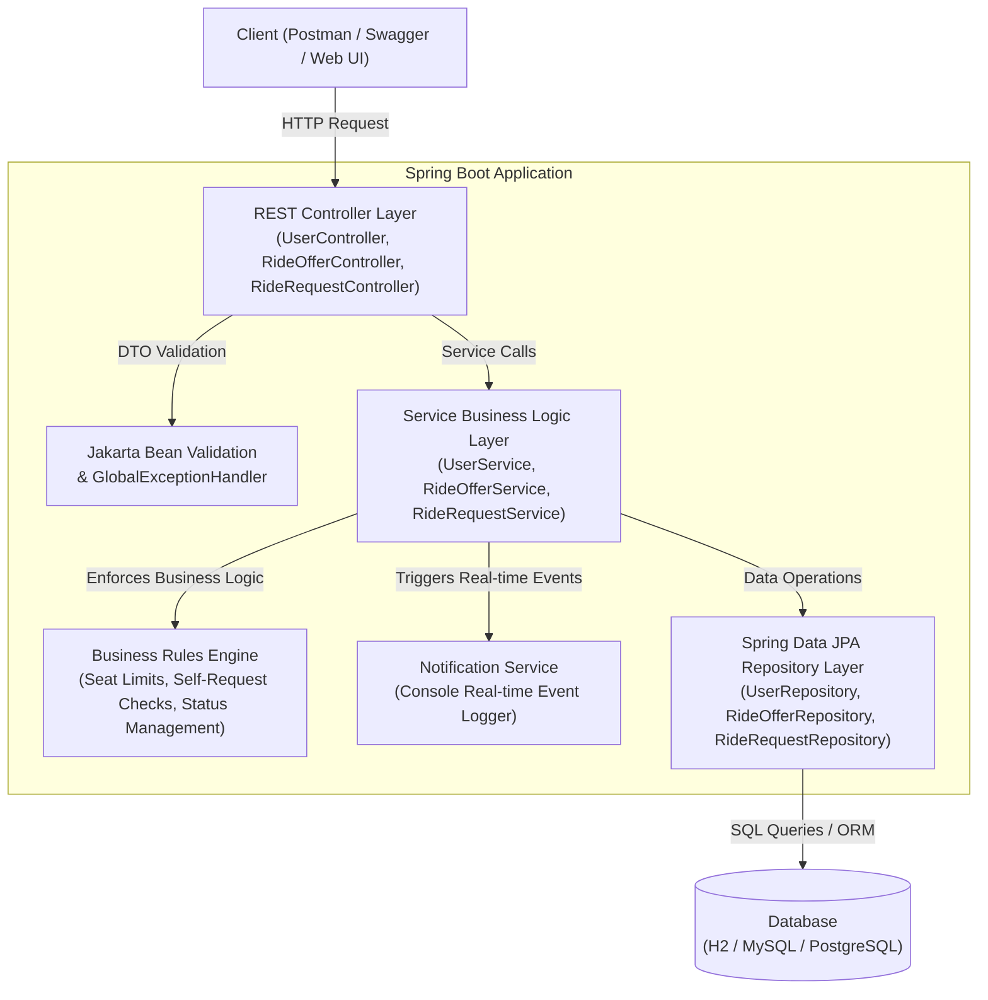
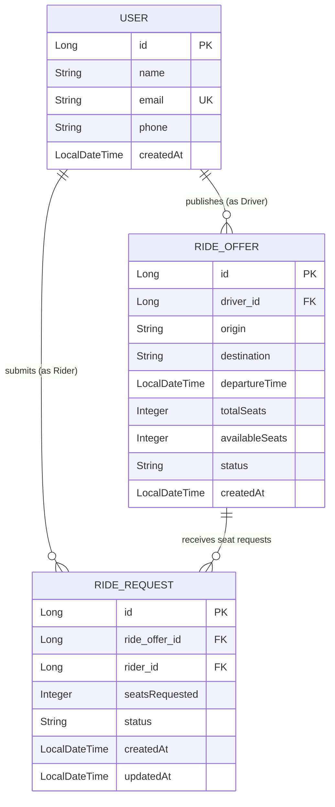
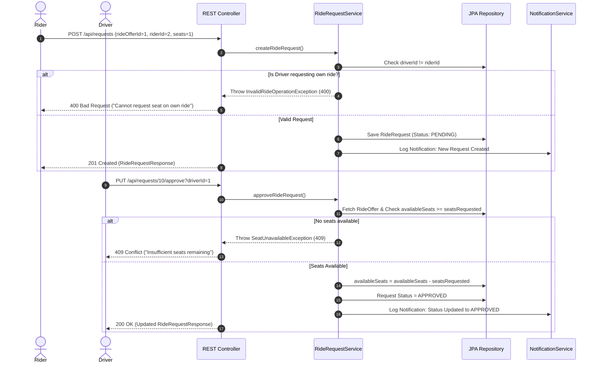

# 🚗 RideShareLite — Office/College Carpool Matching Platform

> **Project Code**: 33. RideShareLite  
> **Course / Assessment**: Project Leap — Java & DBMS Assessment  
> **Institution**: Sri Eshwar College of Engineering  

RideShareLite is a production-grade Spring Boot backend RESTful web application designed to solve single-occupancy vehicle waste for office employees and college students commuting along similar routes. It matches riders to drivers heading the same way based on route matching and time windows while strictly enforcing business rules in the service layer.

---

## 🛠️ Technology Stack & Architecture

| Layer | Technology |
| :--- | :--- |
| **Programming Language** | ☕ Java 21 |
| **Backend Framework** | 🌱 Spring Boot 3.3.4 |
| **API Architecture** | RESTful API |
| **Web Layer** | Spring Web / Spring MVC |
| **Database** | H2 (Dev/In-Memory), MySQL / PostgreSQL (Production ready) |
| **Database Access** | Spring Data JPA |
| **ORM Framework** | Hibernate ORM |
| **Validation** | Jakarta Bean Validation (`@NotNull`, `@NotBlank`, `@Email`, `@Future`, `@Min`) |
| **Exception Handling** | `@ControllerAdvice` (`GlobalExceptionHandler`) |
| **API Documentation** | Swagger UI (`/swagger-ui.html`), OpenAPI 3.0 |
| **API Testing** | Postman Collection (`RideShareLite.postman_collection.json`) |
| **Build Tool** | Apache Maven 3.9.x |
| **Architecture Pattern** | Controller → Service → Repository → Database (Layered Architecture) |

---

## 📐 System Architecture & Diagrams

### 1. Layered Architecture Flow



---

### 2. Entity-Relationship Diagram (ERD)



---

### 3. Seat Request & Approval Sequence Diagram



---

## ⚡ Core Business Rules Enforced

1. **Self-Request Prohibition**: A user cannot request a seat on a ride offer that they published themselves.
2. **Seat Availability Check**: A ride request cannot be approved if `availableSeats` < `requestedSeats` (or no seats remain).
3. **Automatic Seat Deduction**: When a driver approves a ride request, `availableSeats` on the ride offer is automatically reduced by the requested seat count.
4. **Seat Restoration on Cancellation/Rejection**: If an approved request is subsequently cancelled or rejected, the seats are restored to the ride offer's `availableSeats`.
5. **Route & Time Window Search**: Riders can filter published ride offers by origin, destination, and departure time window (start/end time).
6. **User History Aggregation**: Dedicated endpoint (`/api/users/{id}/history`) returns a unified view of all rides published as a driver and all seat requests submitted as a rider.

---

## 🚀 How to Run the Project

### Prerequisites
- **Java**: Version 21 (or 17+)
- **Maven**: Version 3.8+

### Step 1: Clone & Build Project
```bash
cd Ride_Share_lite
mvn clean package
```

### Step 2: Run Application
#### Option A: Default H2 In-Memory Mode (No Setup Required)
```bash
mvn spring-boot:run
```
- App URL: `http://localhost:8080`
- Swagger UI Documentation: `http://localhost:8080/swagger-ui.html`
- H2 Console: `http://localhost:8080/h2-console` (JDBC URL: `jdbc:h2:mem:rideshare`, Username: `sa`, Password: *blank*)

#### Option B: MySQL Mode
1. Create database: `CREATE DATABASE rideshare_db;`
2. Update `src/main/resources/application-mysql.properties` with your MySQL credentials.
3. Run with active profile:
```bash
mvn spring-boot:run -Dspring-boot.run.profiles=mysql
```

#### Option C: PostgreSQL Mode
1. Create database: `CREATE DATABASE rideshare_db;`
2. Update `src/main/resources/application-postgres.properties` with your PostgreSQL credentials.
3. Run with active profile:
```bash
mvn spring-boot:run -Dspring-boot.run.profiles=postgres
```

---

## 📌 REST API Endpoint Reference

| Method | Endpoint | Description | Sample Status Code |
| :--- | :--- | :--- | :--- |
| `POST` | `/api/users` | Register a new user (Driver or Rider) | `201 Created` |
| `GET` | `/api/users` | List all users | `200 OK` |
| `GET` | `/api/users/{id}` | Get user details by ID | `200 OK` |
| `GET` | `/api/users/{id}/history` | **Core Feature 5**: View ride history as Driver & Rider | `200 OK` |
| `POST` | `/api/rides` | **Core Feature 1**: Driver publishes a ride offer | `201 Created` |
| `GET` | `/api/rides/search` | **Core Feature 2**: Rider searches rides by route & time | `200 OK` |
| `GET` | `/api/rides/search/page` | Search rides with pagination & sorting | `200 OK` |
| `GET` | `/api/rides/{id}` | Get ride offer details | `200 OK` |
| `GET` | `/api/rides/driver/{driverId}` | Get all rides published by a driver | `200 OK` |
| `PATCH` | `/api/rides/{id}/status` | Driver updates ride status (PLANNED, COMPLETED, etc.) | `200 OK` |
| `POST` | `/api/requests` | **Core Feature 3**: Rider requests a seat | `201 Created` |
| `PUT` | `/api/requests/{id}/approve` | **Core Feature 3 & 4**: Driver approves request | `200 OK` |
| `PUT` | `/api/requests/{id}/reject` | **Core Feature 3**: Driver rejects request | `200 OK` |
| `PUT` | `/api/requests/{id}/cancel` | Rider cancels request | `200 OK` |
| `GET` | `/api/requests/rider/{riderId}` | Get requests made by rider | `200 OK` |

---

## 🧪 Testing with Postman

Import the provided Postman collection into Postman:
`RideShareLite.postman_collection.json`

### Postman Test Suite Includes:
1. **Normal Flow**:
   - Register Driver & Rider
   - Publish Ride Offer
   - Search Matching Rides
   - Submit Seat Request
   - Approve Seat Request
   - View User Ride History
2. **Edge Cases**:
   - Driver requests own ride -> Returns `400 Bad Request`
   - Requesting seats when 0 seats remain -> Returns `409 Conflict`
   - Validation failure on invalid email/blank fields -> Returns `400 Bad Request`

---

## 🛡️ License
Developed for **Sri Eshwar College of Engineering** — Project Leap & DBMS Assessment.
